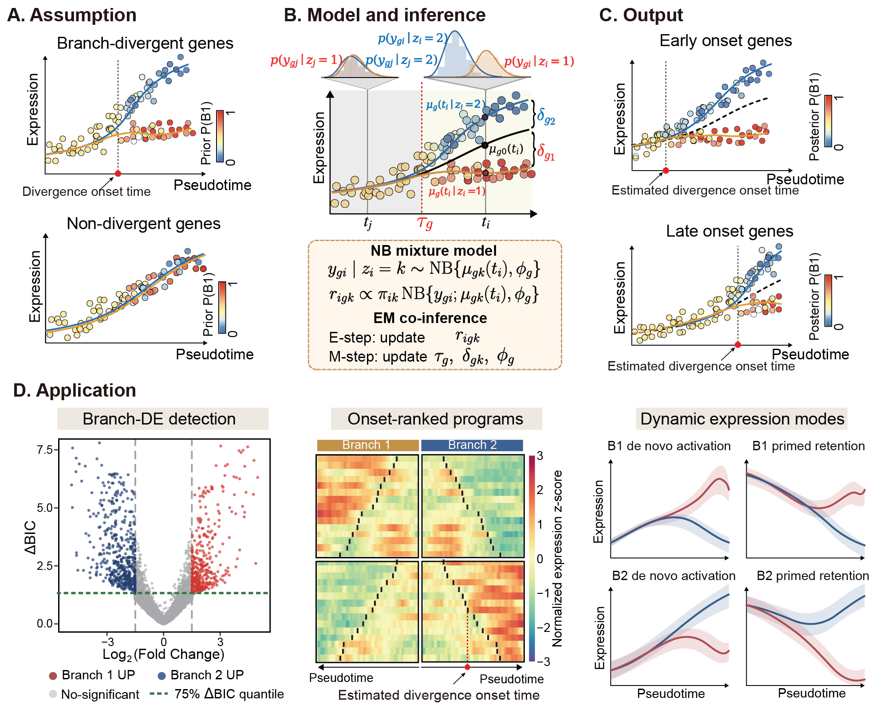

# DivergeDE

[](https://github.com/SDU-W-ZhangLab/DivergeDE/actions/workflows/tests.yml)
[](https://www.python.org/)
[](LICENSE)

**DivergeDE detects branch-divergent genes and estimates when their expression
trajectories begin to separate.** It fits a gene-wise negative-binomial model
to raw counts while retaining soft branch probabilities. The original
two-branch API remains unchanged, and an explicit two-stage API supports a
three-terminal-branch topology.

<p align="center">
  
</p>

DivergeDE reports, for each gene:

- a conditional ΔBIC score for evidence ranking;
- the estimated divergence onset `tau`;
- the fitted mean post-tau log2 fold change between the two branches;
- fitted branch-specific expression curves.

## Installation

DivergeDE requires Python 3.10 or newer.

```bash
python -m pip install "git+https://github.com/SDU-W-ZhangLab/DivergeDE.git"
```

To download the example data and tests:

```bash
git clone https://github.com/SDU-W-ZhangLab/DivergeDE.git
cd DivergeDE
python -m pip install -e ".[test]"
```

## Quick start

```python
import pandas as pd
import divergede

counts = pd.read_csv(
    "data/simulated/simulation_1/counts.csv",
    index_col=0,
)
cells = pd.read_csv(
    "data/simulated/simulation_1/cell_metadata.csv",
    index_col=0,
)

result = divergede.fit(
    counts,
    cells["pseudotime"],
    cells[["branch1_probability", "branch2_probability"]],
    branch_names=("Branch 1", "Branch 2"),
)

print(result.summary.head())
result.to_csv("divergede_summary.csv")
```

Only three inputs are required:

- `counts`: a cell-by-gene matrix of original non-negative integer counts;
- `pseudotime`: a cell-level vector already scaled to `[0, 1]`;
- `branch_probabilities`: a cell-by-2 matrix of non-negative soft branch
  probabilities.

Pandas DataFrames, NumPy arrays, and SciPy sparse count matrices are supported.
Use `genes=[...]` to fit a subset. Size factors are disabled by default; pass
`size_factors="library_size"` or a positive vector to enable an offset.
For a strict no-prior ablation with uniform branch probabilities, pass
zero/one `endpoint_branch_labels`; these labels are used only to determine the
common fitting endpoint and are not used in the expression likelihood.
Uniform-prior fits use a deterministic expression-residual split only to break
the initially symmetric EM solution; all subsequent responsibilities are
updated from the expression likelihood with branch weights fixed at 0.5/0.5.

## Three-branch trajectories

Three-branch fitting requires an explicit topology; DivergeDE never guesses it
from branch endpoints. For a topology in which Ery separates before DC and
Mono separate from each other:

```python
three = divergede.fit_three_branch(
    counts,
    cells["pseudotime"],
    cells[["P_Ery", "P_DC", "P_Mono"]],
    topology=("Ery", ("DC", "Mono")),
    cell_types=cells["cell_type"],  # optional
)
```

If `cell_types` is supplied, terminal endpoints and Stage 2 exclusion use exact
type matches. Otherwise, DivergeDE uses unique maximum-probability labels;
ties do not define an endpoint. The three probability columns are normalized
row by row before constructing the stages.

- Stage 1 fits Ery versus DC+Mono using all cells through the Ery endpoint.
- Stage 2 fits DC versus Mono through their shorter endpoint, excludes Ery
  labels, removes rows with `P(DC)+P(Mono) <= 1e-12`, and renormalizes the two
  remaining probabilities.

Each stage independently uses the q05-q95 pseudotime interval of its retained
cells as the tau search range. The two stage scores are reported separately and
must not be added or replaced by their maximum. `three.rank_genes("stage1")`
and `three.rank_genes("stage2")` provide stable, stage-specific rankings.
Both stages reuse the current unpenalized DivergeDE numerical model with
multiple starts: there is no tau prior and no local-expression support penalty.
With `tau_gap = tau2 - tau1`, the default descriptive labels are `canonical`
for gaps at least 0.1, `inverse` for gaps at most -0.1, and `synchronous`
between those bounds. No order constraint is imposed during fitting.

```python
# Smooth descriptive reconstruction
curves = divergede.get_three_branch_composite_curves(three, gene="GATA1")
figure = divergede.plot_three_branch_composite(three, "GATA1")

# Original numerical fits for auditing
figure = divergede.plot_three_branch_stages(three, "GATA1")
```

The composite is a display reconstruction, not an additional fitted model.
The stage plot is the authoritative view of the two numerical fits.

## Outputs and results

`result.summary` contains:

```text
gene, converged, delta_bic, tau, mean_posttau_log2fc,
loglik_null, loglik_alternative, r_null, r_alternative, n_iter
```

`mean_posttau_log2fc` is the signed pointwise fitted log2 fold change averaged
by 100-point trapezoidal integration from the estimated `tau` to the common
terminal. Positive values indicate higher fitted expression on Branch 1;
negative values indicate higher expression on Branch 2. Non-converged genes
remain in the summary but are excluded from default ranking and plots.

Both two- and three-branch results expose `result.diagnostics`. Fit outcomes
use five statuses: `converged`, `not_fitted`, `max_iter`,
`numerical_failure`, and `error`. Three-branch summaries report
`stage1_mean_posttau_log2fc` and `stage2_mean_posttau_log2fc` for the two
numerical stages. Fits stopped only by the iteration limit can be continued
from their best finite parameters:

```python
refitted = divergede.refit_failed(result, max_iter=300)
```

Save and restore a complete fit with:

```python
result.save("divergede_fit.joblib")
result = divergede.load_result("divergede_fit.joblib")
```

## Plotting

```python
# One gene
figure = divergede.plot_gene(result, gene="gene_001")

# Top genes, with automatic pagination
pages = divergede.plot_genes(
    result,
    top_n=12,
    order_by="delta_bic",  # or "tau"
    ncols=3,
    max_per_page=12,
)

# Conditional ΔBIC versus mean post-tau effect
figure = divergede.plot_bic_vs_posttau_fc(
    result,
    bic_threshold=10,
    log2fc_threshold=1.0,
    label_top=0,
)
```

Cells are colored by their Branch 1 probability. Branch 1 is orange-red,
Branch 2 is blue, and the shared null curve is gray and dashed. Plotting uses a
`log1p` display scale by default; model fitting always uses original counts.

In the ΔBIC-effect plot, genes with `conditional_delta_BIC > 10` and
`abs(mean_posttau_log2fc) >= 1` are highlighted. This prespecified operational
rule is not a p-value, false-discovery-rate cutoff, or conventional
standard-BIC evidence threshold.

## Method notes

The null model is an unpenalized NB2 model with a cubic B-spline baseline. The
alternative keeps this fitted baseline fixed and estimates two branch effects,
a new gene-specific dispersion parameter, and `tau`. Branch effects are zero
through `tau` and turn on smoothly afterward.

The ranking score is

```text
conditional_delta_BIC =
    2 * (loglik_alternative - loglik_null) - 3 * log(n_fit)
```

Because the null baseline is fixed in the alternative and `tau` is not
identified under the null, this is not a standard nested-model BIC. It is
intended for ranking genes within the same dataset.

DivergeDE fits cells only through the shorter branch endpoint. It uses a
temporary hard branch assignment only to identify the two endpoints; all model
fitting uses soft branch probabilities.

Default settings are `spline_df=5`, `kappa=12.0`,
`tau_quantiles=(0.05, 0.95)`, `tau_grid_size=9`, `n_starts=3`, and `n_jobs=4`.
Genes are fitted in parallel with `joblib`'s `loky` process backend.

## Reproducible examples

The repository contains two simulated datasets:

- `simulation_1`: 500 cells and 60 true DE genes, for curve and tau evaluation;
- `simulation_2`: 500 cells and 1000 genes, including 300 structurally
  branch-divergent genes and 700 structural-null genes. The 300 structural DE
  genes are balanced across early, middle, and late divergence (100 each) and
  across weak, moderate, and strong effects (100 each).

### Simulation 2 truth and evaluation definitions

The 300 structural DE genes were sampled without replacement from the 1000
genes and assigned nonzero branch-specific effects. The other 700 genes have
zero branch contrast (`true_delta1 = true_delta2 = 0`). In
`gene_truth.csv`, `is_de` records this structural truth.

Effect size is the true mean absolute post-tau log2 fold change, evaluated over
`[true_tau, 1]`. The weak, moderate, and strong ranges are 0.5-1, 1-2, and 2-3,
respectively. For the manuscript detection benchmark, a gene is a prespecified
effect-qualified positive when

```text
is_de == True and true_abs_mean_posttau_log2fc >= 1
```

This definition gives 200 positives (the moderate and strong structural DE
genes). The 100 weak structural DE genes remain true branch-divergent genes,
but are treated as evaluation negatives for this effect-qualified benchmark;
the other 700 evaluation negatives are structural nulls.

A fitted gene is called positive using the prespecified operational rule

```text
conditional_delta_BIC > 10 and abs(mean fitted post-tau log2FC) >= 1
```

This is an operational detection threshold, not a p-value or FDR cutoff, and
`conditional_delta_BIC > 10` is not presented as a conventional standard-BIC
evidence threshold.

```bash
python examples/simulation_1.py
python examples/simulation_2.py
```

## Citation

DivergeDE is developed by **Ling Sun** and **Naiqian Zhang** at the School of
Mathematics and Statistics, Shandong University at Weihai. Citation metadata
are available in [`CITATION.cff`](CITATION.cff). A manuscript citation will be
added after publication.

Correspondence: [nqzhang@email.sdu.edu.cn](mailto:nqzhang@email.sdu.edu.cn)

## License

DivergeDE is released under the [MIT License](LICENSE).
